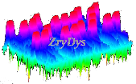

# ZryDys (3Ds) – Innovating Artistic Creation Through Technology  

## **Vision**  
Leverage disruptive technologies like **fractals, AI, and automated algorithms** to **amplify human creativity** and create groundbreaking 3D content for virtual and physical applications.  

---

## **Our Approach**  

### **Three Key Modes of Engagement**  
1. **Browse**: Explore our gallery of unique 3D models.  
2. **Customize**: Design your own models online with our interactive tools.  
3. **Let Us Create**: Commission personalized designs, tailored to your needs.  

### **Additional Services**  
- **Consulting in Data Visualization**: We specialize in real-time cybersecurity and telecom dashboards, combining design and functionality.  

---

## **What We Do**  

- **Produce and Innovate**: Develop **augmented 3D content** using technology, automation, and artistry.  
- **Boost Creativity**: Merge **manual design** with **algorithmic processes** to create scalable, unique designs.  
- **Global Scope**: Serve local and international clients, leveraging open-source tools and collaborative platforms.  

---

## **How We Work**  

- **Open Innovation**: Share our algorithms and techniques through platforms like GitHub, fostering collaboration and learning.  
- **Sustainability**: Promote eco-conscious practices, reusing 3D pieces and advocating for responsible tech use.  
- **Collaboration**: Partner with organizations and creative minds to build a multidisciplinary team.  

---

## **Who We Are**  

- **Founder**: A telecom engineer with 15+ years of experience in coding, integration, and Agile project management across the US and Europe.  
- **Team**: Currently a small, dedicated team with plans to grow through collaborations.  

---

## **Our Portfolio**  

Discover our work:  
- [Web on MCEscher Art](https://zrydys.github.io/esch4.html)
- [Behance](http://behance.net/zrydys)  
- [Pinterest](http://pinterest.com/zrydys)  
- [Dribbble](http://dribbble.com/zrydys)  
- [DeviantArt](http://www.deviantart.com/zrydys)  

---

## **Connect With Us**  

- **Website**: [ZryDys WordPress](https://zrydys.wordpress.com)  
- **GitHub**: [github.com/zrydys](https://github.com/zrydys)  
- **AngelList**: [angel.co/zrydys](http://angel.co/zrydys)  
- **Contact**: Reach out for collaborations or commissions!  

---

# ZryDys ( pronounce 3Ds ) 

fractals in js d3 ...  zrydys.github.io

## links

*Products*: https://be.net/zrydys https://pinterest.com/zrydys https://www.deviantart.com/zrydys

*OpenSource*: https://github.com/zrydys

*Social*:  https://xing.com/profile/zry_dys  https://angel.co/zrydys  TeleGram

*Webs*: https://zrydys.github.io   https://zrydys.wordpress.com  

- https://GitHub.com/ZryDys/fractal see 3d STL models

### Coding examples

The following a examples of commands you can use in linux to handle images:

Sample command to reduce fractal size. (@ GitHub.com/ZryDys)
  
   (ГЭབད); convert 3d_matlab_by_zrydys.png -adaptive-resize 210x105 zrydysML.png 
   
identify fractalgold.png   #% will give you the image dimensions

TBD: minor support:  3d matlab  http://dribbble.com/zrydys   

##### Table of Contents  
[Fractal](#fractal)  
[Links](#links)  

  
 
