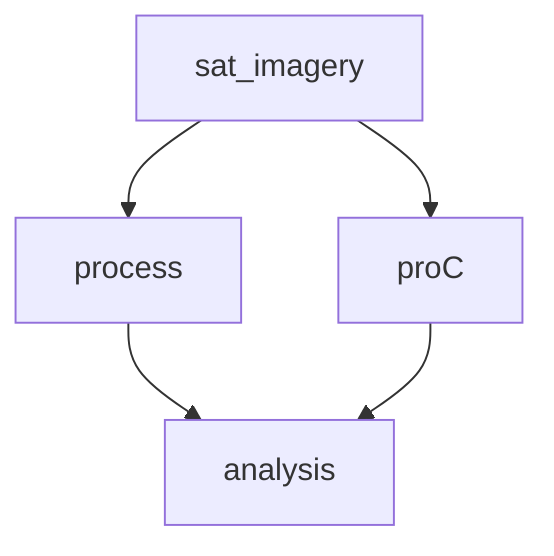
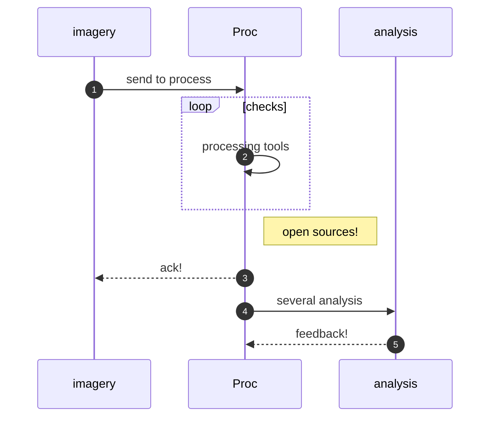

## Geospatial & Imagery analysis with open source 

We aim at **increasing safety by map analysis for rescue** 

**What**: Simple GIS and Open Source tools to analyze locations.

**How**: transparently share open tools and offer support, ranging from business projects to sea rescue. [Circular](circular.html) reusing of COTS or existing devices. 

**Why**: Conscious about safety in rescue and finding missions.

**Where**:  Testing at ElHierro & Ondarroa, more sites under consideration

**Status**: TRL4 x CRL3 . Lab demo of integrated system x Validate the Market hypotheses

**Affordable**
Overall the project relies on open sources and existing devices and transparent collaboration to disseminate know-how and be able to deliver on-time and on-budget:

---

Mission: to bridge the tech gap using open-source tools, training, and low-cost innovation — so even small projects benefit from GIS analysis once reserved for organizations* **.

**Examples of affordable solutions:** adding demo or redundancy:
- Our online demo to interact and display multiple, geospatial views layers for electronic light table  https://zrydys.github.io/elt.html

Promoting **circular economy** solutions where we can share, reuse, repair, refurbish existing devices. (contributing also to diminish pollution on disposal of old cellular or laptops)

---
*ONGOING JULY AUG 2025 ...* 
want to join or collaborate?:  📞 Contact us:  | ✉️ [ZryDys@gmail](mailto:ZryDys@gmail) | 🌐 [ZryDys.github.IO](https://zrydys.github.io) 

-- refs gradually added below:  #map #gis #raspb #pi

### 🌱 Practical Solutions 

An open and agile mindset delivers smart, reusable solutions in today’s circular economy. This GIS summary is freely shared — and we’re here to support you with implementation, training, and guidance every step of the way.

# Technical GIS tools 

Satellite imagery analysis, processing software and techniques as capabilities. Electronic Light Table to view and manipulate images in real-time, or add graphics and text on top.

**[QGIS](https://qgis.org/en/site/)** supports a variety of **open source data formats** and plugins to explore and integrate geospatial data from diverse sources. It can act as an ELT in the sense of managing and analyzing large datasets of satellite or aerial imagery.

**[GRASS GIS](https://grass.osgeo.org/)** work with time series data for geospatial data management and analysis, image processing, graphics and map production.

[Opticks](https://www.opticks.org/#history-of-opticks) open source for electronic light table (ELT), alike commercial ERDAS IMAGINE GLT, RemoteView, ENVI, or SOCET GXP WebView, we can add extensions similar to other remote sensing tool. Used at NASIC for for non-literal exploitation https://github.com/opticks-org.

**[Whitebox GAT](https://www.whiteboxgeo.com/)**  visualize data in 3D, used in the environmental field and academic.

[**gVSIG**](http://www.gvsig.com/en) has various data formats (Shapefiles, GeoTIFFs...) and the **geospatial data management** includes vector and raster data analysis, network analysis, and 3D.

Hubs

- ESA [Sentinel Hub](https://www.sentinel-hub.com/) cloud-based platform for visualizing and analyzing satellite imagery. there is a free tier available for light usage. Real-time satellite imagery from ESA satellites
 
- [NASA WorldWind](https://worldwind.arc.nasa.gov/) open-source virtual globe to interact with global satellite imagery. The platform supports custom imagery layers, vector maps, and geospatial data overlays. It can be useful for building custom ELT tools.

Servers
 
- [MapServer](https://mapserver.org/)  open-source platform for publishing spatial data and interactive mapping applications. raster and vector data   
 
* [GeoServer](http://geoserver.org/)  open-source server for sharing, display, edit, and process geospatial data with standard web services (WMS, WFS, WCS).  

- [TileStache](http://tilestache.org/)  Python-based server for generating and serving raster tiles, useful for map-based imagery applications.  useful for ELT processes.
 
Coding
 
- [OpenLayers](https://openlayers.org/) & Leaflet open-source JavaScript library for displaying maps and geospatial data, interactive web-based ELT applications, to work with imagery in the browser.
 
- [GDAL](https://gdal.org/)  low-level, open-source library for reading and writing raster and vector geospatial data formats or scripting to process ELT-style workflows.

- Examples of Imagery Analysis ELT applications coded in C++ https://techpubs.jurassic.nl/library/manuals/1000/007-1387-050/sgi_html/apg.html

Formats NITF 2.0/2.1, GeoTIFF, ENVI, ASPAM/PAR, CGM, DTED, Generic RAW, ESRI Shapefile, HDF5, AVI, MPEG, JPEG, GIF, PNG, BMP

 

---

 
[rem]: ..

You can visualize the folloiwng charts in github source documents: https://github.com/zrydys/zrydys.github.io/blob/master/gis.md

..

### Refs

References include 

- https://gis.harvard.edu/github-repositories The Center for Geographic Analysis, a member of the [Institute for Quantitative Social Science (IQSS)](http://www.iq.harvard.edu/)
- [Python for GIS Data Science](https://github.com/RGreinacher/python-workshop-gis-big-data)
- Geopandas and Viktor for GIS-analysis.  https://github.com/viktor-platform/gis-analysis/ , also   on [demo.viktor.ai](https://demo.viktor.ai/public/gis-analysis).
- Jekil Mermaid https://antonheitz.github.io/xBRL-Forge/ _ _config.yml

---

🌐languages:  
 [DE🇦🇹🇩🇪](https://translate.google.com/translate?hl=de&sl=auto&u=https://zrydys.github.io/gis.html)
 [FR🇨🇦🇧🇪](https://translate.google.com/translate?hl=fr&sl=auto&u=https://zrydys.github.io/gis.html)
 [NL🇳🇱🇧🇪](https://zrydys-github-io.translate.goog/gis.html?_x_tr_sl=auto&_x_tr_tl=nl&_x_tr_hl=nl)
 [ES🇪🇸🇨🇷](https://zrydys-github-io.translate.goog/gis.html?_x_tr_sl=auto&_x_tr_tl=es&_x_tr_hl=es)
 [EN🇺🇸🇮🇪](https://zrydys.github.io/gis.html)
