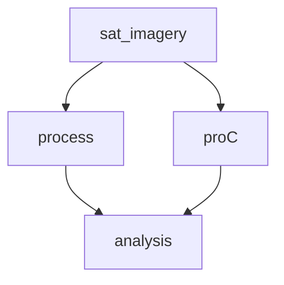
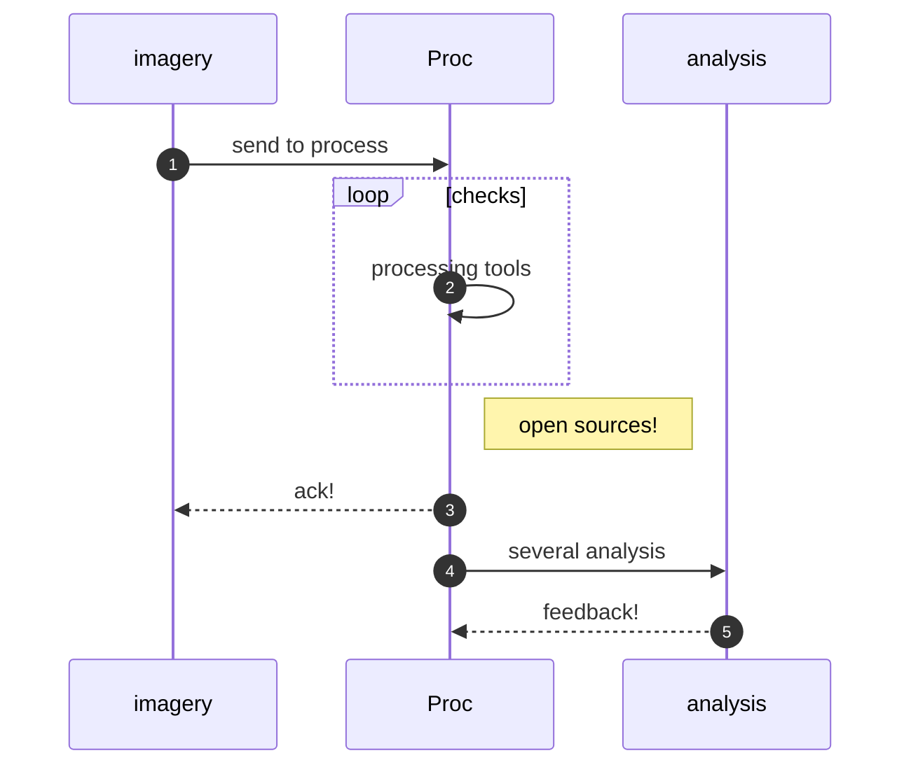

## Geo analysis with open source 

We aim at **increasing safety by map analysis for rescue** 

**What**: Simple GIS and Open Source tools to analyze locations.

**How**: transparently show open tools and offering our support to small business and rescue. [Circular](circular.html) reusing simple devices. 

**Why**: Conscious about safety in rescue and finding missions.

**Where**:  Testing ElHierro & Ondarroa, more  under consideration

**Status**: TRL4 x CRL3 . Lab demo of integrated system x Validate the Market hypotheses

**Affordable**
Overall the project relies on open sources and existing devices and transparent collaboration to disseminate know-how 

*ONGOING JULY AUG 2025 ...* 
want to join or collaborate?:  📞 Contact us:  | ✉️ [ZryDys@gmail](mailto:ZryDys@gmail) | 🌐 [ZryDys.github.IO](https://zrydys.github.io) 

---

Mission: to bridge the tech gap using open-source tools, training, and low-cost innovation — so even small projects benefit from GIS analysis once reserved for organizations* **.

**Examples of affordable solutions:** adding demo or redundancy:

Promoting **circular economy** solutions where we can share, reuse, repair, refurbish existing devices. (contributing also to diminish pollution on disposal of old cellular or laptops)

---
-- refs gradually added below:  #map #gis #raspb #pi

### 🌱 Practical Solutions for SMEs

With an open and agile mindset, we deliver smart, reusable solutions for small businesses in today’s circular economy.

The know how on GIS below are freely shared — and we’re here to support you with implementation, training, and guidance every step of the way.

# Technical GIS tools 

Satellite imagery analysis, processing software and techniques as electronic light table (ELT) capabilities.

**[QGIS](https://qgis.org/en/site/)** supports a variety of **open source data formats** and plugins to explore and integrate geospatial data from diverse sources.

**[GRASS GIS](https://grass.osgeo.org/)** work with time series data for geospatial data management and analysis, image processing, graphics and map production.

**[Whitebox GAT](https://www.whiteboxgeo.com/)**  visualize data in 3D, used in the environmental field and academic.

[**gVSIG**](http://www.gvsig.com/en) has various data formats (Shapefiles, GeoTIFFs...) and the **geospatial data management** includes vector and raster data analysis, network analysis, and 3D.

[rem]: ..

..

### Refs

References include 

- https://gis.harvard.edu/github-repositories The Center for Geographic Analysis, a member of the [Institute for Quantitative Social Science (IQSS)](http://www.iq.harvard.edu/)
- [Python for GIS Data Science](https://github.com/RGreinacher/python-workshop-gis-big-data)
- Geopandas and Viktor for GIS-analysis.  https://github.com/viktor-platform/gis-analysis/ , also   on [demo.viktor.ai](https://demo.viktor.ai/public/gis-analysis).

---

🌐languages:  
 [DE🇦🇹🇩🇪](https://translate.google.com/translate?hl=de&sl=auto&u=https://zrydys.github.io)
 [FR🇨🇦🇧🇪](https://translate.google.com/translate?hl=fr&sl=auto&u=https://zrydys.github.io)
 [NL🇳🇱🇧🇪](https://zrydys-github-io.translate.goog/?_x_tr_sl=auto&_x_tr_tl=nl&_x_tr_hl=nl)
 [ES🇪🇸🇨🇷](https://zrydys-github-io.translate.goog/?_x_tr_sl=auto&_x_tr_tl=es&_x_tr_hl=es)
 [EN🇺🇸🇮🇪](https://zrydys.github.io)
