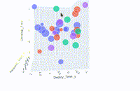

 [ZryDys](https://zrydys.github.io) 🚀 Transforming the Modern Enterprise in key fronts: 

*Integrate Techs |Warning Data |  Resilient Secure  | Efficient Scale | Digital Value*
## Integrate Techs

### Large Technology Integrations

Experienced developing large information systems & advanced telecom applications with partners like Catapult, serving Silicon Valley-grade performance needs.  🔗 https://zrydys.github.io  

We help you empower your organization by seamlessly integrating cutting-edge technologies.

* Tailored software applications and infrastructures in large production environments: including manufacturing plants to automotive robots and critical embedded systems.
- **Client Success:** Engineered telecom applications at **Catapult** serving cutting-edge clients in Silicon Valley, helping develop state-of-the-art systems ahead in a competitive market.

## Warning Data 

### Data Visualization & Early-warnings

Leverage advanced data analytics to drive informed decision-making and uncover actionable insights. Experienced automating business intelligence to optimize from complex operational data.  
- **Client Success:** Delivering Full monitoring and Early-Warning systems  in critical sectors (e.g., Nuclear-Information),  https://zrydys.github.io/visual-plotly.html  

- Delivered [complex BI analyses](visual-plotly.html) navigate **complex data** integrating tools like n8n logic and pandas.
 - Real-time data monitoring and predictive analytics can enhance production planning, reduce downtime, and improve component lifecycle management in smart factories.  

## Resilient Secure

### Cyber Security & Operation Resiliency

Harness modern technologies to deliver & operate secure ICT infrastructures, Designed for best resiliency and  compliant to protect critical assets and ensure compliance.

- **Client Success:** Boosted IT infrastructure monitoring for _Nuclear-grade_ & manufacturing remote sites. 🔗 https://zrydys.github.io/details.html  
- We help collaboration and interconnection by proving a robust cybersecurity and compliance frameworks, essential for protecting IP, networks, and data in modern business .  

## Efficient Scale

### Agile Scale Efficiently  

 ZryDys has enabled cross-sector innovation projects with modular and gradual tech deployment and agile methodologies.  This let you grow business ideas  controlling costs progressively. 

- Experienced applying agile integration techniques in industrial and international teams, quickly adopt new tools—like robotics, digital twins, or IIoT platforms—while minimizing disruption.  
- Cloud solutions offer a scalable service and operations, also facilitates collaboration, data storage, and access to computing resources saving on-premises infrastructure investments.  

## Digital Value

### Digital Customer Value

ZryDys Implemented innovative digital platforms that enhance customer engagement, such as virtual showrooms and interactive services to improve the customer experience.  
 
- **Client Success:** Collaborated with **Local Art & Tourism** to enhance sites and looks:
- example of [online virtual worlds delivered 2025](planet.html): 
- ZryDys built open-source SaaS tools supporting Tourism and Creative communities via gallery-style platforms and modular media tools.  🔗 [https://zrydys.github.io/planet.html](https://zrydys.github.io/planet.html)  

---
ZryDys professional consulting services helps transform organizations' capabilities, focusing on accelerating compliance reporting, optimizing costs, and improving system resilience.  

 
The experiences above (in products, cloud, dashboards, large industrial infrastructures) helped clients with accelerated reporting, optimized cost, enhanced resilience, global access uptime,... and improved their customer experience.  

# 🏢 **Methods well proven across Industry Leaders**

These tools and solutions have empowered organizations across various sectors to achieve operational excellence and innovation.

- **Art&Tourism:** Enhanced site service delivery and innovation through agile methodologies.
- **Catapult:** Developed telecom applications for cutting-edge clients in Silicon Valley.
- **SGIS:** Implemented robust security measures and infrastructure solutions.
- **Motorola:** Engineered advanced technologies at global headquarters and European labs.
- **Nissan-Renault:** Provided remote operational technology support for global manufacturing plants.
- **Zurich:** Secured operations of over 200 finance sites through identity federation and SSO solutions.
- **University Labs:** Conducted pioneering research in security and malware intelligence. 

 
Our approach has consistently delivered measurable results, including:

- Accelerated compliance reporting and cost optimization.
- Enhanced system resilience and security posture.
- Streamlined operations and improved service reliability.
- Fostered innovation through agile development and integration. 

---

# 📞 **Let's Drive Your Success Together**

Ready to transform your organization's capabilities? 

- Contact ZryDys@gmail today to discuss how we can help you achieve your goals.
 