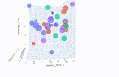
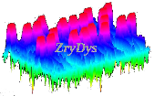

Science Research, Development, Innovation - by ZryDys
-----------------------------------------------------

ZryDys works on Research, Development, and Innovation (R&D+i), delivering results spanning: Integrating data visualization, Deploying services on cloud SaaS, and Strategies for Operational Resilience:

### Advanced Data Science, AI Exploration in 3D & +4Dimensions

At **ZryDys**, we transform complex data into intuitive, actionable visual solutions that enhance decision-making, customer engagement, and workflow efficiency.

-   ZryDys enables teams to explore and analyze data through interactive 3D and 4D plots.
-   Integratin complex instruments, logs, GPS, and databases, adapting to clients\' needs
-   Tailored visualizations to client needs, in platforms such as Tableau, Elastic, PowerBI, Grafana, and Plotly:
-   e.g. Navigate the 3D world below with your VR or **mouse** to browse data!
     

- [3D-navigate Customers Data ](vis-bi-plotly.html) 

- Deploy Operational environment for Medical MRI image analysis  open sources as https://dipterix.org/threeBrain/
- AI organization page at https://huggingface.co/zrydysORG in Hugging Face's ML https://huggingface.co/spaces/zrydys/ml-demo 

### Full Early Warning: From Telemetry to Remote Operation

We developed advanced telemetry systems, real-time monitoring and early warning alerts. Our solutions enable remote operations, ensuring timely responses to potential issues and enhancing operational resilience. Over ten years of experience successfully implementing these systems across
various industries, safeguarding critical operations and minimizing downtime.

### Data recovery from Damaged devices

We restore valuable data for our clients. Data recovery services designed to retrieve information from damaged devices, including hard drives and other storage media. A decade-long track record handling
complex scenarios, in cyber forensic techniques to reconstruct lost data, mitigating data loss and ensuring business continuity.

### Deployed Internet SaaS sites fostering Creative Media

In 2024, ZryDys released a SaaS site with innovative for Creative Media services, such as dynamic 3D effects on audio, videos and images. Offered with or without AI (to guarantee human artistic creations).
Discover it live at [ZryDys.github.io/planet.html](//ZryDys.github.io/planet.html). Cloud independent development (including Python re module, JavaScript match, Yq capture).

---

## Our Approach

- **Customer-Centric Solutions:** We work closely with businesses to identify challenges and tailor visualization tools that address specific needs.
- **Scalable & Secure Insights:** Our visualizations integrate with cloud platforms, ensuring seamless scalability and adherence to modern security standards.
- **Collaboration & Consulting:** We engage with industry leaders to align our solutions with evolving business and technology trends.

ZryDys expertise spans industries, providing interactive dashboards, real-time analytics, and visual storytelling to enhance business intelligence.

## Modern Work & Data-Driven Business Solutions

- **Strategic Data Visualization:** Empower business decision-makers with interactive, data-driven storytelling.
- **Process Optimization:** Identify trends, predict outcomes, and optimize workflows through intuitive visual tools.
- **Security & Compliance:** Implement visualization strategies that align with data security best practices.

Looking for solutions to enhance your business intelligence through cutting-edge data visualization? [Connect with us](mailto:zrydys@gmail?subject=visual-connect)  to explore tailored solutions that drive efficiency and innovation.

------------------------------------------------------------------------

*[ZryDys  ](mailto:zrydys@gmail?subject=visual) leverages extensive experience and cutting-edge technologies, committed to providing reliable and efficient solutions to meet clients\' monitoring, service, and recovery needs.*
